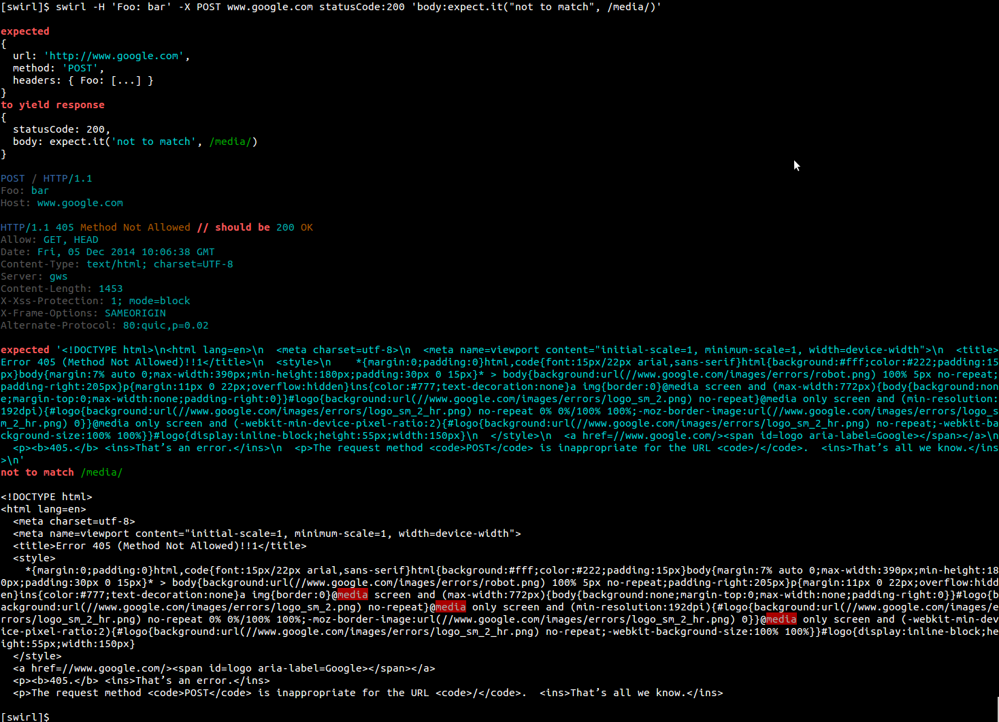

swirl
=====

CLI for testing HTTP servers using a [curl](http://curl.haxx.se/)-like syntax. Powered by [Unexpected](http://github.com/sunesimonsen/unexpected) and [unexpected-http](https://github.com/papandreou/unexpected-http).

